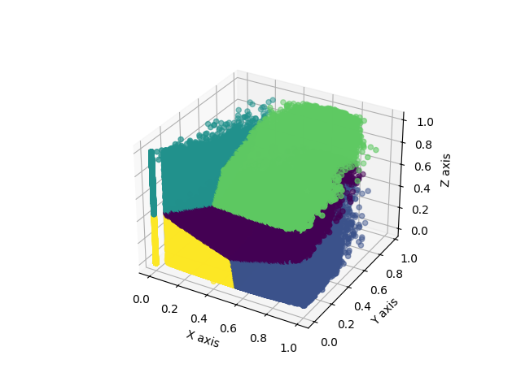

# Genre Reveal
For CS5030 Fall 2023 final project. This project uses the k-means clustering algorithm to cluster this dataset of 1.2M songs from Spotify:

[Spotify 1.2M+ Songs](https://www.kaggle.com/datasets/rodolfofigueroa/spotify-12m-songs)

This project uses serial, shared-memory parallel CPU, shared-memory parallel GPU, distributed-memory CPU, and distributed-memory GPU implementations.

## Building
This project can be built as a CMake project using `CMakeLists.txt`, generally using the following commands:
```bash
cmake -S <source directory> -B <output directory>
cmake --build <output directory>
```
After which, executables can be found in `<output directory>/bin`.

For Windows users, please note that Microsoft Visual Studio must be installed, as well as the NVIDIA Cuda Toolkit.

Alternatively, each implementation can be built separately by following instructions in [doc/separate_build_instructions.md](doc/separate_build_instructions.md)

## Running
Each executable will have usage printed if ran with the incorrect arguments. Generally, the usage is as follows:
```bash
<executable> <path to csv> <number of clusters> <x column key> <y column key> <z column key>
```
The "column keys" refer to features as per the dataset, such as danceability, energy, speechiness, etc.

For distributed implementations (`dist_cpu` and `dist_gpu`), `mpiexec` must be used in order to increase performance, i.e:
```bash
mpiexec -n <number of threads> <executable> <path to csv> <number of clussters> <x column key> <y column key> <z column key>
```

## Approach Descriptions
A description of each approach can be found in [doc/descriptions.md](doc/descriptions.md).

## Scaling Study
A comparison of implementations can be found at [doc/shared_memory_comparison.md](doc/shared_memory_comparison.md) and [doc/distributed_memory_comparison.md](doc/distributed_memory_comparison.md).

## Validation
Each component was verified by comparing the `.csv` output against the serial implementation `.csv` output by running the command:
```bash
diff <serial output csv> <component output csv>
```
If the terminal shows no output, then the two files are the same, and each point is in the same cluster.

## Visualization
The script [visualize.py](visualize.py) can be used to visualize the output with the following usage:
```bash
python visualize.py <path to csv>
```
Please note that this script requires the python packages `matplotlib` and `pandas` to be installed.

An example output with k=5, x="danceability", y="speechiness", and z="acousticness":
<p align="center">
    
</p>

Note that your output may look slightly different, depending on how different systems seed their random number generators.

